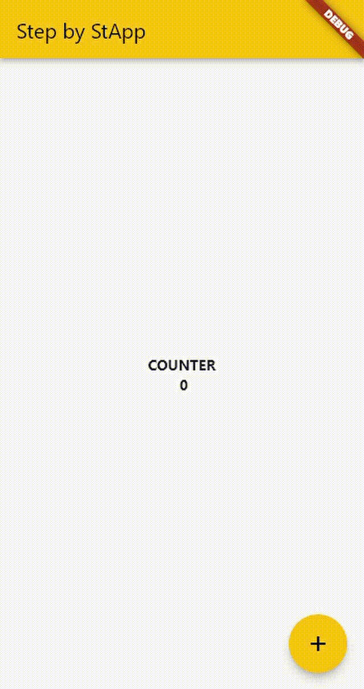

# Step by StApp
📱 First app with Flutter, featuring the famous and so loved number counter!

# 📚 What I Learned

## Folders

### `.dart_tool/` & `.idea/`
Folders for workspace and environment configuration. They are folders that we commonly not change content, so, at this moment, let these untouched.

### `android/` & `ios/` & `web/` & `windows/`
Folders with configuration and additional content for Flutter build into these systems. Here you'll add settings to interact with OS core and deeper functionalities.

### `lib/`
Here is where the magic happens 🧙🏼‍♂️. The code you'll write will be here.

## Files

### `analysis_options.yaml`
File for additional configuration about development experience, like linter settings and related things.

## Functions

### `runApp()`
This is the function that runs your Flutter app inside SDK. Without this, process will not be initiated.

After import design package from Flutter (i.e. `import 'package:flutter/material.dart';`) you're able to call `runApp()` and start development.

As params it receives your master Widget, where your application is within.

## Concepts

### Widget
Basically, all we see (and also what we not see, at some moments, but we'll talk about this later) within a Flutter app is a widget. Since a button until the whole screen.

For start a screen, we can set `Container()` component as master component and then start all the magic putting inside it the widgets.

### Master Component
In general, app always start using as Master Widget the `MaterialApp()` (Android-like design) or `CupertinoApp` (iOS-like design). One of these will be initial component that `runApp()` function will call.

With this master components, that give you several tools, you're able to custom all theme and interactions easy.

But, even starting with only one of them, you are not restricted to only one styles, because you can use both, one inside other one.

### `@override`
Ensure that function we're writing is overriding the one that already exists withing extended class.

### `Stateless` Vs. `Stateful`
These are important concepts in a Flutter application. With both you can offer distinct interaction experiences.

`Stateful` reffers to interfaces that store state, in other words, that change values related with user input.

The best situation to know if your widget is `Stateful` or `Stateless` is basically if this one have some variable or use input value from user. If yes, then use `Stateful`, if not use `Stateless`.

## Tricks

### Reset OS configs
If in some situation you desire reset the configuration applyed at OS folders, you can simply run `flutter create .` inside your app root directory after delete OS folders.

## Widgets

### `Container()`
A container like a `<View />` from React Native.

### `Text()`
A container like a `<Text />` from React Native.

### `Center()`
A wrapper that center content within.

### `Scaffold()`
The skeleton container that works like `<body />` from HTML. It always will be at `home` property from our Master Component.

### `FloatingActionButton()`
That floating button at right inferior corner.

### `Icon()`
Component to add Icons from `Icons` constant.

[rocketseat]: https://www.rocketseat.com.br/
